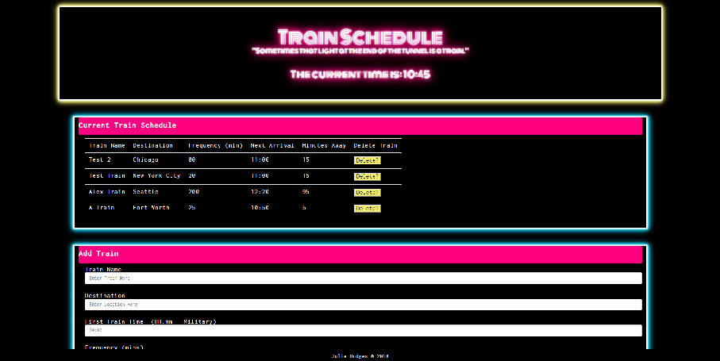

# Train-Schedule:
This interactive site allows the user to operate a fictional train station, enter destination, and see the next arriving train in realtime, as well as delete trains. 

## Developer's Toolkit:
html, css, JavaScript, jquery, firebase, and moment.js

## Live Link:
https://jivinjules.github.io/Train-Schedule/

## Website Screenshot:

